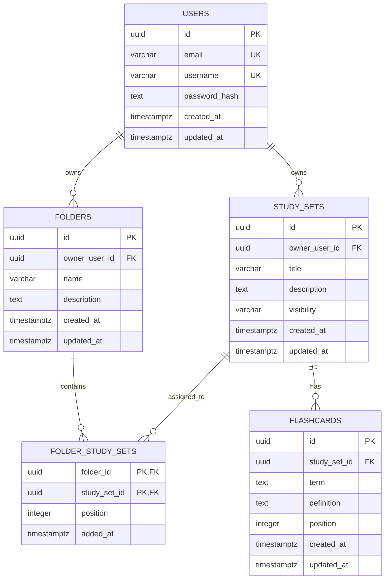

```mermaid
erDiagram
    USERS {
        uuid id PK
        varchar email UK
        varchar username UK
        text password_hash
        timestamptz created_at
        timestamptz updated_at
    }

    FOLDERS {
        uuid id PK
        uuid owner_user_id FK
        varchar name
        text description
        timestamptz created_at
        timestamptz updated_at
    }

    STUDY_SETS {
        uuid id PK
        uuid owner_user_id FK
        varchar title
        text description
        varchar visibility
        timestamptz created_at
        timestamptz updated_at
    }

    FOLDER_STUDY_SETS {
        uuid folder_id PK, FK
        uuid study_set_id PK, FK
        integer position
        timestamptz added_at
    }

    FLASHCARDS {
        uuid id PK
        uuid study_set_id FK
        text term
        text definition
        integer position
        timestamptz created_at
        timestamptz updated_at
    }

    USERS ||--o{ FOLDERS : owns
    USERS ||--o{ STUDY_SETS : owns
    FOLDERS ||--o{ FOLDER_STUDY_SETS : contains
    STUDY_SETS ||--o{ FOLDER_STUDY_SETS : assigned_to
    STUDY_SETS ||--o{ FLASHCARDS : has
```