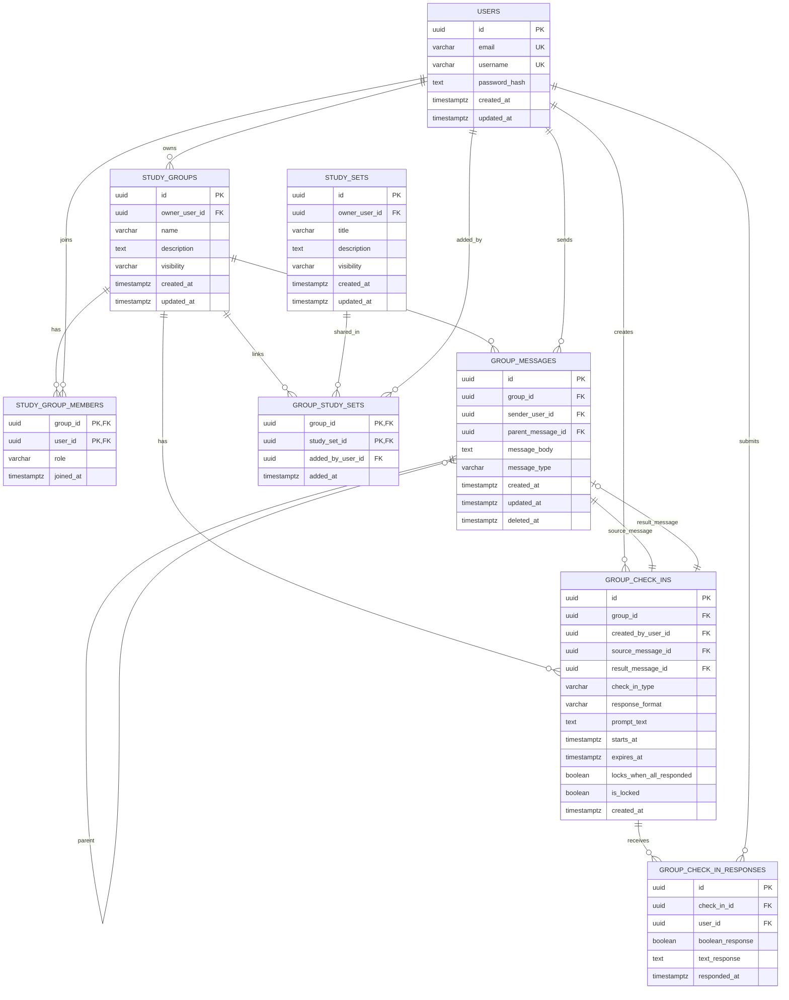

```mermaid
erDiagram
    USERS {
        uuid id PK
        varchar email UK
        varchar username UK
        text password_hash
        timestamptz created_at
        timestamptz updated_at
    }

    STUDY_SETS {
        uuid id PK
        uuid owner_user_id FK
        varchar title
        text description
        varchar visibility
        timestamptz created_at
        timestamptz updated_at
    }

    STUDY_GROUPS {
        uuid id PK
        uuid owner_user_id FK
        varchar name
        text description
        varchar visibility
        timestamptz created_at
        timestamptz updated_at
    }

    STUDY_GROUP_MEMBERS {
        uuid group_id PK, FK
        uuid user_id PK, FK
        varchar role
        timestamptz joined_at
    }

    GROUP_MESSAGES {
        uuid id PK
        uuid group_id FK
        uuid sender_user_id FK
        uuid parent_message_id FK
        text message_body
        varchar message_type
        timestamptz created_at
        timestamptz updated_at
        timestamptz deleted_at
    }

    GROUP_CHECK_INS {
        uuid id PK
        uuid group_id FK
        uuid created_by_user_id FK
        uuid source_message_id FK
        uuid result_message_id FK
        varchar check_in_type
        varchar response_format
        text prompt_text
        timestamptz starts_at
        timestamptz expires_at
        boolean locks_when_all_responded
        boolean is_locked
        timestamptz created_at
    }

    GROUP_CHECK_IN_RESPONSES {
        uuid id PK
        uuid check_in_id FK
        uuid user_id FK
        boolean boolean_response
        text text_response
        timestamptz responded_at
    }

    GROUP_STUDY_SETS {
        uuid group_id PK, FK
        uuid study_set_id PK, FK
        uuid added_by_user_id FK
        timestamptz added_at
    }

    USERS ||--o{ STUDY_GROUPS : owns
    STUDY_GROUPS ||--o{ STUDY_GROUP_MEMBERS : has
    USERS ||--o{ STUDY_GROUP_MEMBERS : joins

    STUDY_GROUPS ||--o{ GROUP_MESSAGES : contains
    USERS ||--o{ GROUP_MESSAGES : sends
    GROUP_MESSAGES ||--o{ GROUP_MESSAGES : parent

    STUDY_GROUPS ||--o{ GROUP_CHECK_INS : has
    USERS ||--o{ GROUP_CHECK_INS : creates
    GROUP_MESSAGES ||--|| GROUP_CHECK_INS : source_message
    GROUP_MESSAGES o|--|| GROUP_CHECK_INS : result_message

    GROUP_CHECK_INS ||--o{ GROUP_CHECK_IN_RESPONSES : receives
    USERS ||--o{ GROUP_CHECK_IN_RESPONSES : submits

    STUDY_GROUPS ||--o{ GROUP_STUDY_SETS : links
    STUDY_SETS ||--o{ GROUP_STUDY_SETS : shared_in
    USERS ||--o{ GROUP_STUDY_SETS : added_by
```
