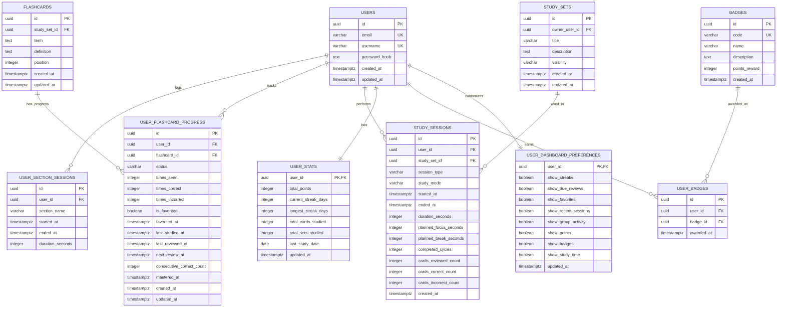

```mermaid
erDiagram
    USERS {
        uuid id PK
        varchar email UK
        varchar username UK
        text password_hash
        timestamptz created_at
        timestamptz updated_at
    }

    STUDY_SETS {
        uuid id PK
        uuid owner_user_id FK
        varchar title
        text description
        varchar visibility
        timestamptz created_at
        timestamptz updated_at
    }

    FLASHCARDS {
        uuid id PK
        uuid study_set_id FK
        text term
        text definition
        integer position
        timestamptz created_at
        timestamptz updated_at
    }

    USER_SECTION_SESSIONS {
        uuid id PK
        uuid user_id FK
        varchar section_name
        timestamptz started_at
        timestamptz ended_at
        integer duration_seconds
    }

    USER_FLASHCARD_PROGRESS {
        uuid id PK
        uuid user_id FK
        uuid flashcard_id FK
        varchar status
        integer times_seen
        integer times_correct
        integer times_incorrect
        boolean is_favorited
        timestamptz favorited_at
        timestamptz last_studied_at
        timestamptz last_reviewed_at
        timestamptz next_review_at
        integer consecutive_correct_count
        timestamptz mastered_at
        timestamptz created_at
        timestamptz updated_at
    }

    STUDY_SESSIONS {
        uuid id PK
        uuid user_id FK
        uuid study_set_id FK
        varchar session_type
        varchar study_mode
        timestamptz started_at
        timestamptz ended_at
        integer duration_seconds
        integer planned_focus_seconds
        integer planned_break_seconds
        integer completed_cycles
        integer cards_reviewed_count
        integer cards_correct_count
        integer cards_incorrect_count
        timestamptz created_at
    }

    USER_STATS {
        uuid user_id PK, FK
        integer total_points
        integer current_streak_days
        integer longest_streak_days
        integer total_cards_studied
        integer total_sets_studied
        date last_study_date
        timestamptz updated_at
    }

    BADGES {
        uuid id PK
        varchar code UK
        varchar name
        text description
        integer points_reward
        timestamptz created_at
    }

    USER_BADGES {
        uuid id PK
        uuid user_id FK
        uuid badge_id FK
        timestamptz awarded_at
    }

    USER_DASHBOARD_PREFERENCES {
        uuid user_id PK, FK
        boolean show_streaks
        boolean show_due_reviews
        boolean show_favorites
        boolean show_recent_sessions
        boolean show_group_activity
        boolean show_points
        boolean show_badges
        boolean show_study_time
        timestamptz updated_at
    }

    USERS ||--o{ USER_SECTION_SESSIONS : logs
    USERS ||--o{ USER_FLASHCARD_PROGRESS : tracks
    FLASHCARDS ||--o{ USER_FLASHCARD_PROGRESS : has_progress

    USERS ||--o{ STUDY_SESSIONS : performs
    STUDY_SETS ||--o{ STUDY_SESSIONS : used_in

    USERS ||--|| USER_STATS : has
    USERS ||--o{ USER_BADGES : earns
    BADGES ||--o{ USER_BADGES : awarded_as
    USERS ||--|| USER_DASHBOARD_PREFERENCES : customizes
```